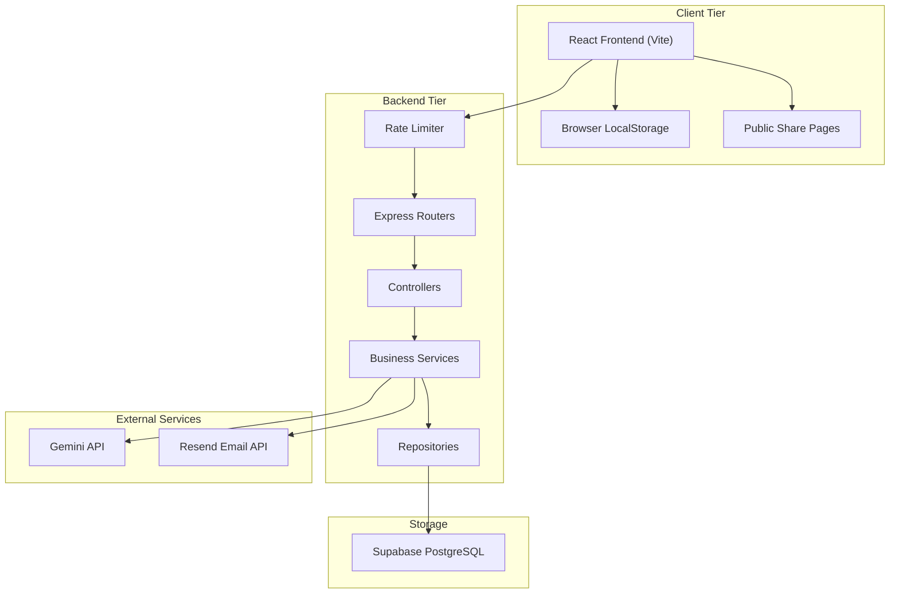
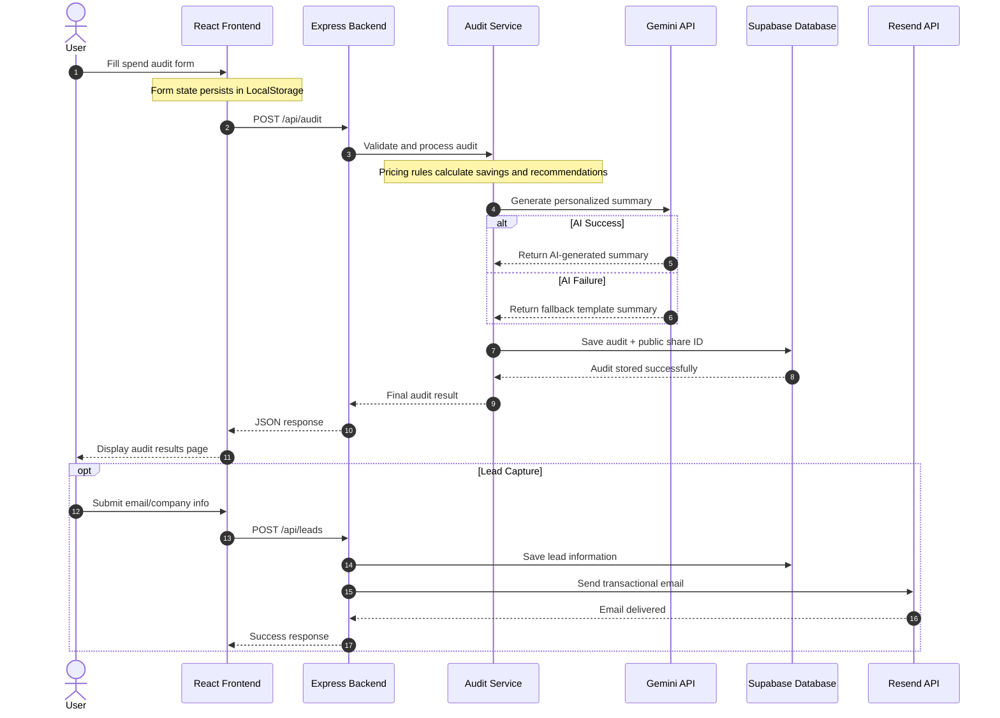
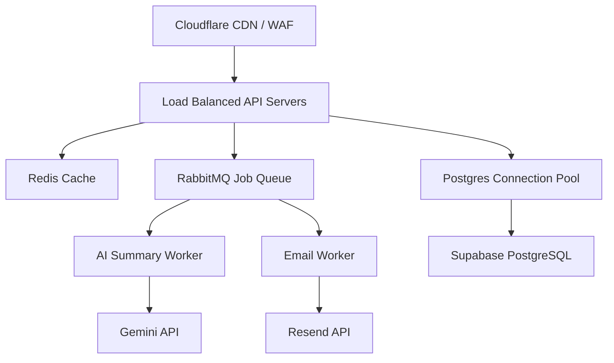

# System Architecture of Token Tracer

Token Tracer is a full-stack AI spend auditing platform built with a React frontend and a layered Node.js Express backend. The system analyzes AI tool subscriptions, generates optimization recommendations, stores audits and leads, and creates shareable public reports.

---

# 1. System Topology & Tier Architecture

---

# 2. End-to-End Data Flow

The following sequence diagram shows how a user's spend inputs become a completed audit result.

---

# 3. Why I Chose This Stack

| Layer | Technology | Reason                                                                                                                                                                                                                                                                                                                  |
|---|---|-------------------------------------------------------------------------------------------------------------------------------------------------------------------------------------------------------------------------------------------------------------------------------------------------------------------------|
| Language | JavaScript | TypeScript was strongly considered, but I chose JavaScript to move faster during MVP development and focus more on product execution, architecture, and deployment within the 7-day timeline. I am currently learning TypeScript and preferred using a stack I could debug and ship confidently under time constraints. |
| Frontend | React + Vite | React provides component-based UI development while Vite offers fast builds and an excellent developer experience.                                                                                                                                                                                                      |
| Styling | TailwindCSS | Makes responsive UI development faster without relying on large UI frameworks.                                                                                                                                                                                                                                          |
| Backend | Node.js + Express | Lightweight and flexible backend stack that is easy to structure into layered services and controllers.                                                                                                                                                                                                                 |
| Database | Supabase PostgreSQL | Provides a managed PostgreSQL database with a simple SDK and fast setup for MVP development.                                                                                                                                                                                                                            |
| AI | Gemini API | Generates personalized audit summaries quickly with low latency and affordable pricing.                                                                                                                                                                                                                                 |
| Email | Resend API | Simple transactional email API with modern developer tooling.                                                                                                                                                                                                                                                           |
| Testing | Vitest | Fast test runner with built-in mocking support and easy integration with Vite.                                                                                                                                                                                                                                          |
| Deployment | Vercel + Render | Vercel simplifies frontend deployment while Render provides easy backend hosting for Express applications.                                                                                                                                                                                                              |

---

# 4. Scaling to 10,000 Audits / Day

If Token Tracer needed to support 10,000+ audits per day, several architectural improvements would be required to improve scalability, reliability, and performance.

## Planned Scaling Improvements

### 1. Background Job Queues
Currently, AI summary generation and email sending happen during the request lifecycle. At higher traffic volumes, these operations should move to asynchronous workers using RabbitMQ and Redis.

### 2. Redis Caching
Frequently accessed public audit share pages should be cached in Redis to reduce database load and improve response times.

### 3. Database Connection Pooling
A connection pooler such as PgBouncer would help manage large numbers of concurrent PostgreSQL connections efficiently.

### 4. Horizontal API Scaling
Multiple backend API instances behind a load balancer would improve reliability and throughput during traffic spikes.

### 5. CDN & Edge Security
Cloudflare would be used for:
- CDN asset delivery
- DDoS protection
- edge caching
- request filtering
- global performance improvements

### 6. Monitoring & Observability
Production-scale deployments would require:
- centralized logging
- request tracing
- uptime monitoring
- performance metrics
- error alerting