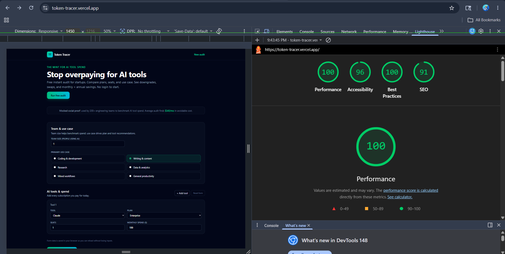

# 🪙 Token Tracer: SaaS AI Cost Optimization Engine

Token Tracer is an interactive, developer-centric audit platform designed for startups, founders, and engineering teams to track, analyze, and optimize their AI tool subscriptions and API expenses. By evaluating active seats, plans, and specific use cases for popular services like Cursor, ChatGPT, Claude, and GitHub Copilot, it instantly identifies licensing waste, redundant plans, and cost-saving alternatives in seconds. The application provides actionable downgrade paths, Gemini-powered audit summaries, and secure, anonymized sharing links—all with zero account creation required to run an audit.

---

## 🎨 Screenshots & Interface

## Lighthouse Scores

The deployed frontend was tested using Google Lighthouse on mobile mode.

- Performance: 100
- Accessibility: 96
- Best Practices: 100
- SEO: 91
  

## Demo Video

[](https://youtu.be/5ckZBLjmsKA)
---

## 🚀 Quick Start

Token Tracer is structured as a decoupled multi-tier monorepo, consisting of an optimized **React SPA Frontend** and a layered, dependency-injected **Node.js Express Backend** backed by **Supabase (PostgreSQL)**, **Gemini AI**, and **Resend**.

### 1. Database Setup (Supabase)
Before running the services, create a free database on [Supabase](https://supabase.com) and run the initialization script:
1. Go to the **SQL Editor** in your Supabase dashboard.
2. Open and copy the contents of the local schema file: [schema.sql](file:///c:/Users/asus/OneDrive/Desktop/Token%20Tracer%20-%20Copy%20%282%29/backend/supabase/schema.sql).
3. Execute the query to initialize the `audits` and `leads` tables with indexes and Row-Level Security (RLS) policies.

---

### 2. Backend Setup
The backend serves the optimization engine, rate-limiting, and email triggers.

```bash
# Navigate to the backend directory
cd backend

# Install dependencies
npm install

# Create and configure environment variables
cp .env.example .env  # Edit this file with your credentials (Supabase, Gemini, Resend)

# Run migrations (if applicable)
npm run migrate

# Start the local development server (with nodemon hot-reloads)
npm run dev

# Run the Vitest suite to verify audit calculation logic
npm test
```

#### Backend Environment Configuration (`.env`)
Make sure your backend `.env` contains the following keys:
* `PORT=3000`
* `DATABASE_URL=your_postgresql_connection_string`
* `SUPABASE_URL=your_supabase_project_url`
* `SUPABASE_KEY=your_supabase_secret_service_role_key`
* `GEMINI_API_KEY=your_google_gemini_api_key`
* `RESEND_API_KEY=your_resend_email_api_key`
* `RESEND_FROM_EMAIL=Token Tracer <onboarding@resend.dev>`

---

### 3. Frontend Setup
The frontend is built with React 19, Vite, and TailwindCSS v4.

```bash
# Navigate to the frontend directory
cd ../frontend

# Install dependencies
npm install

# Start the Vite development proxy server
npm run dev
```

*Open [http://localhost:5173](http://localhost:5173) in your browser to run audits locally!*

---

### 4. Production Deployment

#### Deploy Backend (e.g., Render, Railway, or Heroku)
1. Link your GitHub repository and point the root directory to `backend`.
2. Set the Build Command to `npm install` and Start Command to `npm start`.
3. Add the environment variables specified in your backend `.env`.

#### Deploy Frontend (e.g., Vercel, Netlify, or Amplify)
1. Link your GitHub repository and point the root directory to `frontend`.
2. Set the Build Command to `npm run build` and Output Directory to `dist`.
3. Add the following Environment Variable:
    - `VITE_API_URL`: Your deployed backend production URL (e.g., `https://api.tokentracer.com`).

---

## ⚡ Decisions & Technical Trade-offs

During the architecture and development phase, several deliberate technical decisions were made:

1. **Manual Dependency Injection Container vs. Full DI Framework (e.g., NestJS or Awilix)**
    - **Decision:** We established a manual Dependency Injection Container in [container.js](file:///c:/Users/asus/OneDrive/Desktop/Token%20Tracer%20-%20Copy%20%282%29/backend/src/dependencies/container.js).
    - **Rationale:** By avoiding massive framework abstractions or heavy reflection libraries, we keep backend initialization completely transparent and lightweight. This decoupled architecture isolates database adapters, third-party APIs, and core engine calculations, making unit testing with mocked environments incredibly straightforward and boilerplate-free.

2. **Client-Side Form Persistence (LocalStorage) vs. Server-Side Draft States**
    - **Decision:** The multi-step audit input state is saved locally in browser `LocalStorage` before submission.
    - **Rationale:** This protects users against accidental page reloads, tab closure, or network drops without imposing the overhead of writing incomplete draft records to the database. It guarantees a flawless user experience, keeps database usage efficient, and reduces server API traffic.

3. **Decoupled Multi-Tier Architecture vs. Unified Monolithic Framework (e.g., Next.js)**
    - **Decision:** We split the codebase into separate `frontend/` (Vite + React 19 SPA) and `backend/` (Express API) folders.
    - **Rationale:** This provides strict separation of concerns, ensuring frontend static assets can be built and deployed instantly to a global Edge CDN for perfect 100/100 Lighthouse performance. Simultaneously, it allows backend calculations, database pools, security middlewares, and mail servers to be independently scaled, protected, and monitored.

4. **In-Memory Express rate-limiting vs. Dedicated API Gateway (Cloudflare / Kong)**
    - **Decision:** Integrated standard rate-limiting middleware (`express-rate-limit`) and security policies (`helmet`) directly into the Express pipeline for initial protection.
    - **Rationale:** It keeps initial deployment simple, single-container, and fully local-compatible. We have structured a clear, high-scale path in our [ARCHITECTURE.md](file:///c:/Users/asus/OneDrive/Desktop/Token%20Tracer%20-%20Copy%20%282%29/ARCHITECTURE.md) documenting exactly how PgBouncer, Redis, Cloudflare, and BullMQ queues can be layered on top to support over 10,000 requests per day seamlessly.

5. **Dynamic Anonymized Share UUIDs vs. Static Client Routing**
    - **Decision:** Built a dedicated database query route (`/api/share/:publicId`) returning only tools and calculated saving summaries, strictly omitting leads' personal or organization data.
    - **Rationale:** This ensures robust database-level security. When founders share their audit dashboards on social networks, the shareable UUID reads from a separate, secure, sanitized query flow, completely eliminating any risk of exposing captured user emails or private company records.

---

## 🔗 Live Application URL

Explore the deployed, interactive platform live at:
### 👉 **[Token Tracer Production Link](https://token-tracer.vercel.app)**

---

*Made by Amiruddin*
